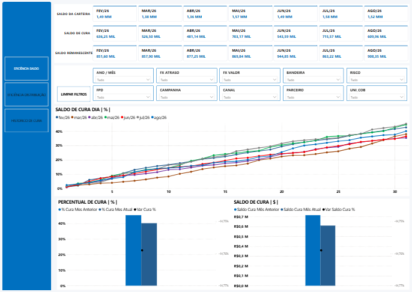
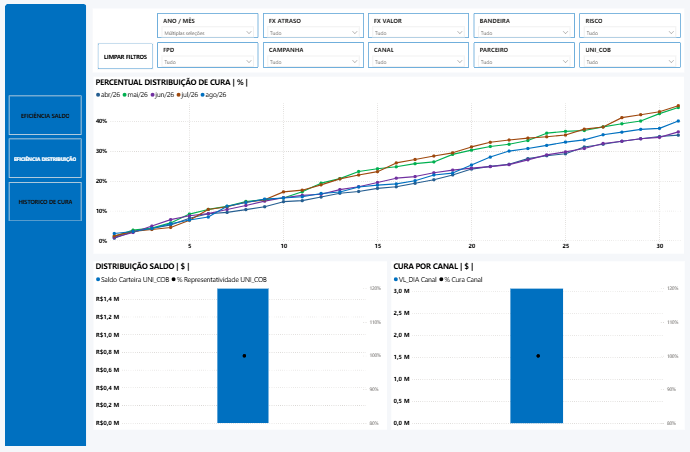
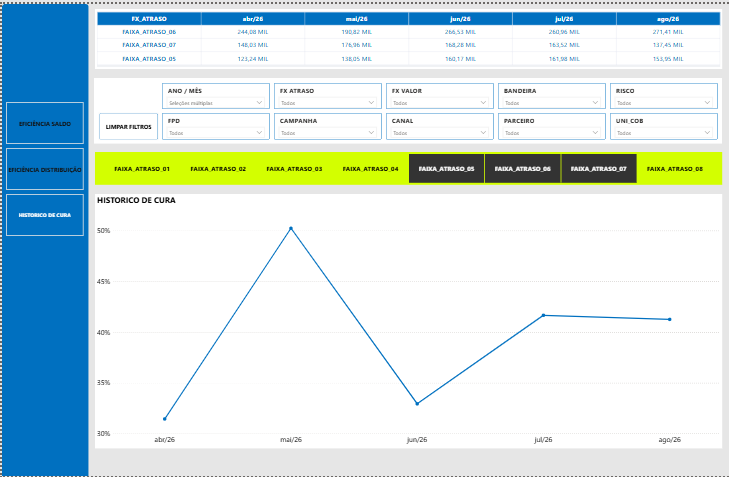

# Performance Analytics

**Python · SQL · Amazon S3 · Amazon Athena · Power BI · DAX**

Projeto educacional de **Data Analytics aplicado a uma carteira de crédito**, desenvolvido com dados 100% sintéticos para analisar carteira, risco, PDD, atraso e recuperação ao longo do tempo.

> Nenhum dado real de clientes, contratos ou empresas é utilizado.

---

## 🔎 Problema

Consolidar e analisar o comportamento de uma carteira de crédito — volume, risco, provisão (PDD), atraso e recuperação — a partir de um pipeline de dados na nuvem, culminando em um dashboard executivo.

---

## 🔄 Pipeline

```text
Synthetic Data
      ↓
Python (pandas)
      ↓
Parquet
      ↓
Amazon S3
      ↓
Amazon Athena
      ↓
Power BI
```

---

## 📊 Dataset

| Item      |   Valor |
| --------- | ------: |
| Registros |   5.000 |
| Variáveis |      25 |
| Formato   | Parquet |

Principais variáveis: `saldo`, `saldo_pdd`, `atraso`, `risco`, `recuperado`, `canal`, `cliente_uf`, `parceiro`.

---

## 📊 Principais Resultados

| Indicador    |        Valor |
| ------------ | ------------: |
| Contas       |         5.000 |
| Carteira     |   R$ 10,39 mi |
| Ticket médio |   R$ 2.077,84 |
| PDD          |    R$ 3,20 mi |

---

## ☁️ AWS

* **S3** — armazenamento dos dados em formato Parquet
* **Athena** — consultas SQL sobre os dados no S3

| Recurso | Nome                |
| ------- | ------------------- |
| Banco   | `credit_analytics`  |
| Tabela  | `credit_portfolio`  |

---

## 🧮 SQL Analytics

As consultas SQL foram desenvolvidas no **Amazon Athena** para analisar a carteira armazenada no S3.

As queries estão organizadas na pasta `sql/`:

| Arquivo | Descrição |
|---------|-----------|
| `01_portfolio_overview.sql` | Indicadores gerais da carteira |
| `02_risk_analysis.sql` | Distribuição por nível de risco |
| `03_pdd_analysis.sql` | PDD por nível de risco |
| `04_delinquency_analysis.sql` | Análise por faixa de atraso |
| `05_recovery_analysis.sql` | Recuperação por canal |
| `06_segmentation_analysis.sql` | Segmentação por estado, parceiro e canal |
| `07_concentration_analysis.sql` | Concentração nas maiores contas |
| `08_temporal_analysis.sql` | Evolução mensal da carteira |
| `00_create_external_table.sql` | Criação da tabela externa no Athena |

### Exemplos de consultas

**Indicadores gerais:**

```sql
SELECT
    COUNT(DISTINCT numero_conta) AS quantidade_contas,
    SUM(saldo) AS carteira_total,
    SUM(saldo_pdd) AS pdd_total,
    AVG(saldo) AS ticket_medio,
    SUM(saldo_pdd) / NULLIF(SUM(saldo), 0) AS pdd_rate
FROM credit_analytics.credit_portfolio;
```

**Análise por risco:**

```sql
SELECT
    risco,
    COUNT(DISTINCT numero_conta) AS quantidade_contas,
    SUM(saldo) AS carteira_total,
    SUM(saldo_pdd) AS pdd_total
FROM credit_analytics.credit_portfolio
GROUP BY risco
ORDER BY carteira_total DESC;
```

**Evolução mensal:**

```sql
SELECT
    date_trunc('month', referencia) AS mes_referencia,
    COUNT(DISTINCT numero_conta) AS quantidade_contas,
    SUM(saldo) AS carteira_total,
    SUM(saldo_pdd) AS pdd_total
FROM credit_analytics.credit_portfolio
GROUP BY date_trunc('month', referencia)
ORDER BY mes_referencia;
```

As consultas apoiam as análises de carteira, risco, PDD, atraso, recuperação, concentração, segmentação e evolução temporal utilizadas no dashboard.

---

## 📸 Dashboard

**Eficiência de Saldo** — evolução do saldo de cura por dia e comparativo mês a mês.



**Eficiência de Distribuição** — percentual de cura distribuído por canal e representatividade do saldo.



**Histórico de Cura** — evolução do percentual de cura por faixa de atraso ao longo dos meses.



---

## 🧠 Análises

* **Eficiência de Saldo** — saldo da carteira, saldo de cura e saldo remanescente por mês
* **Eficiência de Distribuição** — distribuição do percentual de cura por canal
* **Histórico de Cura** — evolução do percentual de cura por faixa de atraso (FX_ATRASO)
* **Segmentação** — filtros por FPD, campanha, canal, parceiro, bandeira, risco e unidade de cobrança

---

## 📈 Power BI

Dashboard executivo com indicadores de:

**Carteira · Risco · Atraso · PDD · Recuperação · Evolução**

Construído com medidas DAX sobre uma base consolidada, incluindo lógica de tratamento de valores repetidos (AVERAGEX) e truncamento de linha para o mês corrente.

---

## 🗂️ Estrutura

```text
Performance-Analytics/
├── data/
│   └── BASE_ANALYTICS_MOCK.parquet
├── notebooks/
│   └── Base_Analytics.ipynb
├── src/
│   └── data_generator.py
├── sql/
│   ├── 01_portfolio_overview.sql
│   ├── 02_risk_analysis.sql
│   ├── 03_pdd_analysis.sql
│   ├── 04_delinquency_analysis.sql
│   ├── 05_recovery_analysis.sql
│   ├── 06_segmentation_analysis.sql
│   ├── 07_concentration_analysis.sql
│   ├── 08_temporal_analysis.sql
│   └── 00_create_external_table.sql
├── powerbi/
│   └── Eficiencia.pbix
├── screenshots/
│   ├── eficiencia_saldo.png
│   ├── eficiencia_distribuicao.png
│   └── historico_cura.png
├── requirements.txt
├── .gitignore
├── LICENSE
└── README.md
```

---

## 🚀 Execução

```bash
python -m venv .venv
```

**Windows:**

```bash
.venv\Scripts\activate
```

Instale as dependências:

```bash
pip install -r requirements.txt
```

Gere a base sintética:

```bash
python src/data_generator.py
```

Abra o notebook de validação:

```bash
jupyter notebook notebooks/Base_Analytics.ipynb
```

Abra o dashboard `powerbi/Eficiencia.pbix` no Power BI Desktop.

---

## 🛠️ Stack

**Python · Pandas · SQL · Amazon S3 · Amazon Athena · Parquet · Power BI · DAX**

Conceitos:

**Data Analytics · Credit Analytics · Cloud Data Pipeline · Risk Analysis · Delinquency Analysis · Recovery Analysis**

---

## 🔐 Segurança

* Todos os dados são sintéticos.
* Nenhuma informação real ou confidencial é utilizada.
* Credenciais da AWS não devem ser armazenadas no repositório.

---

## ⚠️ Limitações

* Dados totalmente sintéticos.
* Não representa metodologia regulatória.
* Não inclui modelos preditivos ou estratégias de cobrança.

---

## 📌 Objetivo

Demonstrar um pipeline completo de:

Data Analytics → Cloud (S3/Athena) → Business Metrics → Segmentation → Temporal Analysis → Business Insights.

> Projeto educacional desenvolvido exclusivamente com dados sintéticos.
